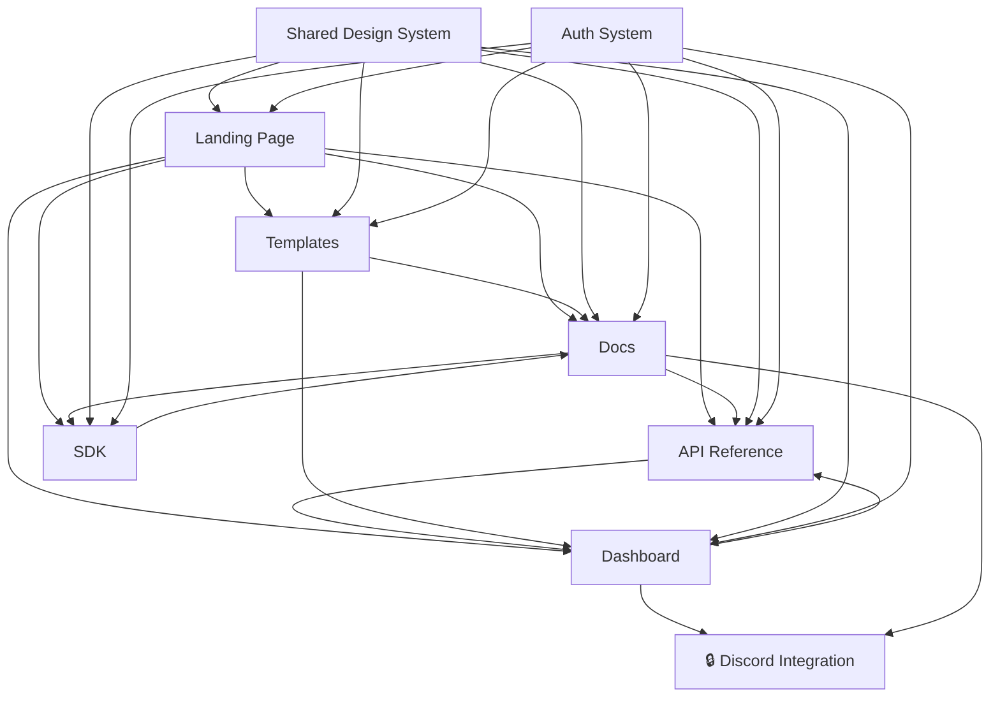

# 🏗️ Modular Architecture Design for aethex.dev Developer Platform

**Status:** Phase 1 Analysis Complete  
**Date:** January 7, 2026

---

## 📋 Executive Summary

This document outlines the transformation of aethex-forge from a multi-purpose ecosystem hub into **aethex.dev** - a professional developer platform while preserving all existing functionality (including 🔒 Discord Activity).

**Current State:**
- Single monolithic React SPA with 843-line App.tsx
- 90+ routes serving multiple audiences (developers, creators, staff, corporate clients, investors)
- Mixed concerns: documentation, dashboards, community, staff tools, marketing pages
- Existing docs system with 50+ markdown files

**Target State:**
- Modular developer platform with clear information architecture
- Distinct feature modules (Docs, API Reference, Dashboard, SDK, Templates, Marketplace)
- Developer-first UX (clean, technical aesthetic like Vercel/Stripe)
- All existing functionality preserved and accessible

---

## 🎯 Module Structure Overview

```
aethex.dev/
│
├── 🏠 Landing (New Developer Platform Homepage)
│   └── Marketing, value props, quick starts, featured integrations
│
├── 📚 /docs - Documentation System
│   ├── Getting Started
│   ├── Tutorials & Guides
│   ├── Platform Concepts
│   ├── Integrations (Discord, Unity, Roblox, etc.)
│   ├── API Concepts
│   └── Examples & Code Samples
│
├── 🔧 /api-reference - Interactive API Documentation
│   ├── Authentication
│   ├── Endpoints by Category (Creators, GameForge, Passport, etc.)
│   ├── Interactive Playground
│   └── Webhooks & Events
│
├── 📊 /dashboard - Developer Dashboard
│   ├── API Keys Management
│   ├── Usage Analytics
│   ├── Integration Settings
│   ├── Billing (future)
│   └── Projects
│
├── 📦 /sdk - SDK Distribution & Documentation
│   ├── JavaScript/TypeScript SDK
│   ├── Python SDK
│   ├── Unity SDK (C#)
│   ├── Unreal SDK (C++)
│   └── Version Management
│
├── 🎨 /templates - Project Templates & Boilerplates
│   ├── Template Library
│   ├── Template Details
│   ├── "Use Template" Flow
│   └── Community Templates (future)
│
├── 🏪 /marketplace - Plugin/Module Marketplace (Phase 2)
│   ├── Browse Plugins
│   ├── Product Details
│   ├── Purchase/Install
│   └── Developer Portal (for sellers)
│
├── 🧪 /playground - Code Sandbox (Phase 2)
│   └── Interactive coding environment
│
└── 🔒 PROTECTED ZONES (Unchanged)
    ├── /discord - Discord Activity
    ├── /activity - Activity alias
    ├── /discord-verify - Account linking
    └── /api/discord/* - All Discord endpoints
```

---

## 📊 Current Route Analysis & Mapping

### Category 1: Developer Platform Routes (ENHANCE)

**Documentation Routes (34 routes)**
```
Current:
├── /docs (with nested routes via DocsLayout)
├── /docs/tutorials
├── /docs/getting-started
├── /docs/platform
├── /docs/api
├── /docs/cli
├── /docs/examples
├── /docs/integrations
└── /docs/curriculum

👉 Action: ENHANCE with new developer platform design
   - Keep all existing routes
   - Apply new design system
   - Add three-column layout (nav | content | examples)
   - Add interactive code playgrounds
   - Consolidate Discord docs into main docs system
```

**Dashboard Routes (6 routes)**
```
Current:
├── /dashboard (main dashboard)
├── /dashboard/nexus (Nexus-specific)
├── /dashboard/labs (redirects to aethex.studio)
├── /dashboard/gameforge (GameForge management)
└── /dashboard/dev-link (redirects to Nexus)

👉 Action: TRANSFORM into Developer Dashboard
   - Keep /dashboard as main developer dashboard
   - Add /dashboard/api-keys (NEW)
   - Add /dashboard/usage (NEW) 
   - Add /dashboard/settings (NEW)
   - Add /dashboard/billing (NEW - placeholder)
   - Keep /dashboard/nexus, /dashboard/gameforge for specific services
```

**Profile & Auth Routes (13 routes)**
```
Current:
├── /profile, /profile/me
├── /profile/applications
├── /profile/link-discord (🔒 PROTECTED)
├── /passport, /passport/me, /passport/:username
├── /login, /signup, /reset-password
├── /onboarding
└── /roblox-callback, /web3-callback

👉 Action: INTEGRATE with developer dashboard
   - Keep all existing routes
   - Add developer-specific profile sections
   - Link from dashboard to profile settings
```

### Category 2: 🔒 PROTECTED Discord Activity (DO NOT MODIFY)

```
🔒 /discord - Discord Activity main page
🔒 /discord/callback - OAuth callback
🔒 /discord-verify - Account verification/linking
🔒 /activity - Activity alias
🔒 /api/discord/* - All Discord backend endpoints

👉 Action: PROTECT and REFERENCE
   - Do not modify routes
   - Do not modify components
   - Add Discord integration to new docs as featured example
   - Link from developer dashboard to Discord connection status
```

### Category 3: Community & Creator Routes (KEEP AS-IS)

**Creator Network (8 routes)**
```
├── /creators (directory)
├── /creators/:username (profiles)
├── /opportunities (hub)
├── /opportunities/post
├── /opportunities/:id
├── /developers (directory)
└── /dev-link (redirects to opportunities)

👉 Action: MAINTAIN
   - Keep all routes functional
   - Apply new design system for consistency
   - Link from developer landing page as "Hire Developers" CTA
```

**Community Routes (15 routes)**
```
├── /community/* (main community hub)
├── /feed (redirects to /community/feed)
├── /arms (community arms/chapters)
├── /teams, /squads, /mentee-hub
├── /projects, /projects/new, /projects/:id/board
├── /projects/admin
├── /realms
└── /ethos/* (music licensing system - 4 routes)

👉 Action: MAINTAIN
   - Keep all routes functional
   - Link from main nav as "Community"
   - Apply design system for consistency
```

### Category 4: Corporate & Services Routes (KEEP AS-IS)

**Corp Routes (9 routes)**
```
├── /corp (main corporate services page)
├── /corp/schedule-consultation
├── /corp/view-case-studies
├── /corp/contact-us
├── /engage (pricing)
├── /game-development
├── /mentorship
├── /research
└── Legacy redirects: /consulting, /services → /corp

👉 Action: MAINTAIN
   - Keep all routes functional
   - Link from footer as "Enterprise Solutions"
   - Separate from developer platform UX
```

**Foundation Routes (2 routes)**
```
├── /foundation (redirects to aethex.foundation)
├── /gameforge (public, redirects to aethex.foundation/gameforge)
└── /gameforge/manage (local, for management)

👉 Action: MAINTAIN
   - Keep redirects functional
   - Link from footer
```

### Category 5: Staff & Internal Routes (KEEP AS-IS)

**Staff Routes (18 routes)**
```
├── /staff (staff portal)
├── /staff/login
├── /staff/dashboard
├── /staff/directory
├── /staff/admin
├── /staff/chat
├── /staff/docs
├── /staff/achievements
├── /staff/announcements
├── /staff/expense-reports
├── /staff/marketplace
├── /staff/knowledge-base
├── /staff/learning-portal
├── /staff/performance-reviews
├── /staff/project-tracking
└── /staff/team-handbook

👉 Action: MAINTAIN
   - Keep all routes functional
   - Not part of public developer platform
   - Separate authentication and access control
```

**Admin Routes (5 routes)**
```
├── /admin (main admin panel)
├── /admin/feed (feed management)
├── /admin/docs-sync (GitBook sync)
├── /bot-panel (Discord bot admin)
└── Internal docs hub (/internal-docs/* - 15 routes)

👉 Action: MAINTAIN
   - Keep all routes functional
   - Not part of public developer platform
```

### Category 6: Informational & Marketing Routes (KEEP AS-IS)

**Marketing Pages (14 routes)**
```
├── / (homepage - currently SubdomainPassport)
├── /about, /contact, /get-started
├── /explore
├── /investors
├── /roadmap, /trust, /press
├── /downloads
├── /status, /changelog
├── /support
├── /blog, /blog/:slug
└── /wix, /wix/case-studies, /wix/faq

👉 Action: TRANSFORM Homepage
   - Replace / with new developer platform landing page
   - Keep all other routes
   - Link from footer and main nav
   - Apply consistent navigation
```

**Legal Routes (3 routes)**
```
├── /privacy
├── /terms
└── /careers

👉 Action: MAINTAIN
   - Keep all routes
   - Update with developer platform links in footer
```

**Hub Routes (6 routes)**
```
Client Hub (for corporate clients):
├── /hub/client
├── /hub/client/dashboard
├── /hub/client/projects
├── /hub/client/invoices
├── /hub/client/contracts
├── /hub/client/reports
└── /hub/client/settings

👉 Action: MAINTAIN
   - Keep all routes functional
   - Separate from developer platform
```

### Category 7: External Redirects (MAINTAIN)

```
├── /labs → https://aethex.studio
├── /foundation → https://aethex.foundation
├── /gameforge → https://aethex.foundation/gameforge
└── Various legacy redirects

👉 Action: MAINTAIN
   - Keep all redirects functional
   - Document in sitemap
```

---

## 🎨 Shared Components Inventory

### Core Shared Components (Keep & Enhance)

**Navigation Components**
```typescript
// Current
- Navigation bar (part of various layouts)
- Footer (various implementations)

// Needed for Developer Platform
✅ /client/components/dev-platform/DevPlatformNav.tsx
   - Top navigation with module switcher
   - Search command palette (Cmd+K)
   - User menu with API keys link

✅ /client/components/dev-platform/DevPlatformFooter.tsx
   - Ecosystem links (aethex.net, .info, .dev)
   - Resources, Legal, Social
   - Consistent across all pages

✅ /client/components/dev-platform/Breadcrumbs.tsx
   - Path navigation
   - Used in docs, API reference, dashboard
```

**Layout Components**
```typescript
// Current
- DocsLayout (for /docs routes)
- Various page layouts

// Needed for Developer Platform
✅ /client/components/dev-platform/layouts/DevPlatformLayout.tsx
   - Base layout wrapper
   - Includes nav, footer, main content area

✅ /client/components/dev-platform/layouts/ThreeColumnLayout.tsx
   - For docs and API reference
   - Left: Navigation tree
   - Center: Content
   - Right: Code examples / Table of contents

✅ /client/components/dev-platform/layouts/DashboardLayout.tsx
   - Dashboard sidebar
   - Main content area
   - Stats overview
```

**Design System Components**
```typescript
// Current (from shadcn/ui)
- Already have: Button, Card, Input, Select, Dialog, Toast, etc.
- Location: /client/components/ui/

// Needed (New Developer Platform Specific)
✅ /client/components/dev-platform/ui/CodeBlock.tsx
   - Syntax highlighting (Prism.js)
   - Copy button
   - Language selector tabs
   - Line numbers

✅ /client/components/dev-platform/ui/ApiEndpointCard.tsx
   - Method badge (GET, POST, etc.)
   - Endpoint path
   - Description
   - Try It button

✅ /client/components/dev-platform/ui/StatCard.tsx
   - Dashboard metrics display
   - Icon, label, value, trend

✅ /client/components/dev-platform/ui/Callout.tsx
   - Info, Warning, Success, Error variants
   - Icon, title, description

✅ /client/components/dev-platform/ui/CommandPalette.tsx
   - Cmd+K search
   - Quick navigation
   - Command shortcuts

✅ /client/components/dev-platform/ui/LanguageTab.tsx
   - Code example language switcher
   - JavaScript, Python, cURL, etc.

✅ /client/components/dev-platform/ui/TemplateCard.tsx
   - Template preview
   - Stats (stars, forks, uses)
   - Use Template button

✅ /client/components/dev-platform/ui/ApiKeyManager.tsx
   - Create, view, revoke API keys
   - Masked display
   - Copy to clipboard

✅ /client/components/dev-platform/ui/UsageChart.tsx
   - Recharts integration
   - API usage over time
   - Filterable time ranges
```

**Context Providers (Keep All)**
```typescript
// Current (KEEP ALL)
- AuthProvider - Authentication state
- DiscordProvider - 🔒 PROTECTED
- DiscordActivityProvider - 🔒 PROTECTED
- Web3Provider - Web3 connection
- DocsThemeProvider - Docs theme
- ArmThemeProvider - Community arms
- MaintenanceProvider - Maintenance mode
- SubdomainPassportProvider - Subdomain routing
- QueryClientProvider - React Query

// New (Add for Developer Platform)
✅ DevPlatformProvider
   - Developer-specific state (API keys, usage stats)
   - Command palette state
   - Recent searches
```

---

## 🗂️ Proposed Directory Structure

```
client/
├── App.tsx (UPDATE: Add new developer platform routes)
│
├── pages/
│   ├── Index.tsx (REPLACE: New developer platform landing)
│   │
│   ├── dev-platform/ (NEW: Developer platform pages)
│   │   ├── DevLanding.tsx (New developer homepage)
│   │   │
│   │   ├── docs/ (ENHANCE existing /docs pages)
│   │   │   ├── DocsHome.tsx
│   │   │   ├── DocsGettingStarted.tsx (existing)
│   │   │   ├── DocsTutorials.tsx (existing)
│   │   │   ├── DocsIntegrations.tsx (existing)
│   │   │   └── [...]
│   │   │
│   │   ├── api-reference/ (NEW)
│   │   │   ├── ApiReferenceHome.tsx
│   │   │   ├── ApiAuthentication.tsx
│   │   │   ├── ApiEndpoints.tsx
│   │   │   ├── ApiPlayground.tsx
│   │   │   └── ApiWebhooks.tsx
│   │   │
│   │   ├── dashboard/ (NEW: Developer dashboard)
│   │   │   ├── DeveloperDashboard.tsx
│   │   │   ├── ApiKeysManagement.tsx
│   │   │   ├── UsageAnalytics.tsx
│   │   │   ├── IntegrationSettings.tsx
│   │   │   └── BillingPage.tsx (placeholder)
│   │   │
│   │   ├── sdk/ (NEW)
│   │   │   ├── SdkHome.tsx
│   │   │   ├── SdkJavaScript.tsx
│   │   │   ├── SdkPython.tsx
│   │   │   ├── SdkUnity.tsx
│   │   │   └── SdkUnreal.tsx
│   │   │
│   │   ├── templates/ (NEW)
│   │   │   ├── TemplateLibrary.tsx
│   │   │   ├── TemplateDetail.tsx
│   │   │   └── UseTemplate.tsx
│   │   │
│   │   └── marketplace/ (NEW - Phase 2)
│   │       ├── MarketplaceHome.tsx
│   │       ├── ProductDetail.tsx
│   │       └── SellerPortal.tsx
│   │
│   ├── 🔒 Discord* (PROTECTED - Do not modify)
│   │   ├── DiscordActivity.tsx
│   │   ├── DiscordOAuthCallback.tsx
│   │   └── DiscordVerify.tsx
│   │
│   ├── Dashboard.tsx (KEEP: General dashboard, links to developer dashboard)
│   ├── Profile.tsx (KEEP)
│   ├── Login.tsx (KEEP)
│   ├── [...] (All other existing pages - KEEP)
│
├── components/
│   ├── ui/ (EXISTING: shadcn/ui components - KEEP)
│   │
│   ├── dev-platform/ (NEW: Developer platform components)
│   │   ├── DevPlatformNav.tsx
│   │   ├── DevPlatformFooter.tsx
│   │   ├── Breadcrumbs.tsx
│   │   ├── SearchCommandPalette.tsx
│   │   │
│   │   ├── layouts/
│   │   │   ├── DevPlatformLayout.tsx
│   │   │   ├── ThreeColumnLayout.tsx
│   │   │   └── DashboardLayout.tsx
│   │   │
│   │   ├── docs/
│   │   │   ├── DocsSidebar.tsx
│   │   │   ├── DocsTableOfContents.tsx
│   │   │   ├── CodeBlock.tsx
│   │   │   ├── Callout.tsx
│   │   │   └── LanguageTabs.tsx
│   │   │
│   │   ├── api/
│   │   │   ├── ApiPlayground.tsx
│   │   │   ├── ApiEndpointCard.tsx
│   │   │   ├── RequestBuilder.tsx
│   │   │   └── ResponseViewer.tsx
│   │   │
│   │   ├── dashboard/
│   │   │   ├── ApiKeyManager.tsx
│   │   │   ├── ApiKeyCard.tsx
│   │   │   ├── UsageChart.tsx
│   │   │   ├── StatCard.tsx
│   │   │   └── ActivityFeed.tsx
│   │   │
│   │   ├── sdk/
│   │   │   ├── SdkCard.tsx
│   │   │   ├── InstallInstructions.tsx
│   │   │   ├── VersionSelector.tsx
│   │   │   └── DownloadButton.tsx
│   │   │
│   │   └── templates/
│   │       ├── TemplateCard.tsx
│   │       ├── TemplatePreview.tsx
│   │       └── UseTemplateButton.tsx
│   │
│   ├── docs/ (EXISTING: Current docs components)
│   │   └── DocsLayout.tsx (ENHANCE with new design)
│   │
│   └── [...] (All other existing components - KEEP)
│
├── contexts/
│   ├── DiscordContext.tsx (🔒 PROTECTED)
│   ├── DiscordActivityContext.tsx (🔒 PROTECTED)
│   ├── DevPlatformContext.tsx (NEW)
│   └── [...] (All other existing contexts - KEEP)
│
├── hooks/ (NEW)
│   ├── useApiKeys.ts
│   ├── useUsageStats.ts
│   ├── useTemplates.ts
│   └── useCommandPalette.ts
│
└── lib/
    ├── utils.ts (EXISTING - KEEP)
    ├── api-client.ts (NEW: Developer API client)
    └── syntax-highlighter.ts (NEW: Prism.js integration)
```

```
api/
├── discord/ (🔒 PROTECTED - Do not modify)
│   ├── activity-auth.ts
│   ├── link.ts
│   ├── token.ts
│   ├── create-linking-session.ts
│   ├── verify-code.ts
│   └── oauth/
│       ├── start.ts
│       └── callback.ts
│
├── developer/ (NEW: Developer platform APIs)
│   ├── keys/
│   │   ├── create.ts
│   │   ├── list.ts
│   │   ├── revoke.ts
│   │   └── validate.ts
│   │
│   ├── usage/
│   │   ├── analytics.ts
│   │   ├── stats.ts
│   │   └── export.ts
│   │
│   └── templates/
│       ├── list.ts
│       ├── get.ts
│       └── clone.ts
│
└── [...] (All other existing API routes - KEEP)
```

---

## 📐 Dependencies Between Modules



**Key Dependencies:**
1. **Shared Design System** → All modules
2. **Auth System** → Dashboard, API Reference (playground), Templates
3. **Docs** → API Reference (links to concepts), SDK (documentation)
4. **Dashboard** → API Reference (usage stats), Discord (connection status)
5. **Templates** → Docs (guides), Dashboard (deployed projects)

---

## 🛡️ Protected Zone Integration

### How Developer Platform Interfaces with Discord Activity

**Allowed Integrations:**

✅ **In Documentation** (`/docs/integrations/discord`)
- Reference Discord Activity as a featured integration
- Link to protected Discord documentation (consolidated guides)
- Show code examples using Discord SDK
- Tutorial: "Building a Discord Activity with AeThex"

✅ **In API Reference** (`/api-reference/discord`)
- Document (read-only) Discord API endpoints
- Show request/response examples
- Link to Discord Activity authentication docs
- Note: "See Discord Activity documentation for implementation"

✅ **In Dashboard** (`/dashboard/integrations`)
- Show Discord connection status (linked/not linked)
- Display Discord username if linked
- Button: "Manage Discord Connection" → redirects to `/profile/link-discord` (🔒 protected route)
- Show Discord Activity usage stats (if available)

✅ **In Landing Page** (`/`)
- Feature Discord Activity as "Build Games Inside Discord"
- Screenshot/demo of Discord Activity
- CTA: "Learn More" → `/docs/integrations/discord`

**Forbidden Actions:**

❌ Do not modify `/discord`, `/discord-verify`, `/activity` routes
❌ Do not modify `DiscordActivity.tsx`, `DiscordOAuthCallback.tsx`, `DiscordVerify.tsx` components
❌ Do not modify `/api/discord/*` endpoints
❌ Do not change `DiscordProvider` or `DiscordActivityProvider` logic
❌ Do not remove or relocate Discord manifest file

---

## 🎯 Implementation Strategy

### Phase 1: Foundation (Week 1-2)

**Week 1: Design System & Core Components**
1. Create `/client/components/dev-platform/` directory structure
2. Implement core UI components (CodeBlock, ApiEndpointCard, StatCard, Callout)
3. Build navigation components (DevPlatformNav, DevPlatformFooter, Breadcrumbs)
4. Create layout components (DevPlatformLayout, ThreeColumnLayout, DashboardLayout)
5. Set up DevPlatformContext provider
6. Define design tokens (colors, typography, spacing) for developer platform

**Week 2: Route Structure & Landing Page**
1. Add new routes to App.tsx (dashboard, api-reference, sdk, templates)
2. Create developer platform landing page (`/pages/dev-platform/DevLanding.tsx`)
3. Replace homepage (`/` route) with new developer landing
4. Ensure all existing routes remain functional
5. Test navigation between old and new sections

### Phase 2: Documentation System (Week 3-4)

**Week 3: Docs Framework**
1. Enhance existing `/docs` routes with new design system
2. Implement three-column layout for docs
3. Add command palette (Cmd+K) search
4. Create docs navigation tree component
5. Set up syntax highlighting for code blocks

**Week 4: Discord Documentation Consolidation**
1. Read and analyze all 14 Discord documentation files
2. Create consolidated guides:
   - `discord-integration-guide.md`
   - `discord-activity-reference.md`
   - `discord-deployment.md`
3. Archive old Discord docs to `/docs/archive/discord/`
4. Integrate into main docs navigation at `/docs/integrations/discord`
5. Cross-link between new guides

### Phase 3: Developer Dashboard (Week 5-6)

**Week 5: API Key Management**
1. Create database schema for API keys
2. Implement `/api/developer/keys/*` endpoints
3. Build API key management UI (`/dashboard/api-keys`)
4. Implement key generation, viewing, revoking
5. Add API key authentication middleware

**Week 6: Usage Analytics**
1. Implement usage tracking for API calls
2. Create `/api/developer/usage/*` endpoints
3. Build analytics dashboard UI (`/dashboard/usage`)
4. Integrate recharts for visualizations
5. Add real-time updates or polling

### Phase 4: API Reference & SDK (Week 7-8)

**Week 7: Interactive API Reference**
1. Create API reference pages (`/api-reference`)
2. Document all API endpoints by category
3. Build API endpoint documentation format
4. Implement syntax highlighting for examples
5. Create tabbed code examples (JavaScript, Python, cURL)

**Week 8: API Playground & SDK Pages**
1. Build ApiPlayground component
2. Implement request builder and response viewer
3. Create SDK landing page (`/sdk`)
4. Build SDK-specific documentation pages
5. Add version selector and download tracking

### Phase 5: Templates & Polish (Week 9-10)

**Week 9: Templates System**
1. Design templates database schema
2. Create `/api/templates/*` endpoints
3. Build template library UI (`/templates`)
4. Implement template card components
5. Create "Use Template" flow

**Week 10: QA & Performance**
1. Accessibility audit (WCAG 2.1 AA)
2. Performance optimization (Lighthouse > 90)
3. Mobile responsiveness testing
4. Cross-browser testing
5. Security audit

### Phase 6: Deployment (Week 11-12)

**Week 11: Staging Deployment**
1. Set up staging environment
2. Deploy to staging
3. Run smoke tests
4. Gather internal feedback
5. Fix critical bugs

**Week 12: Production Launch**
1. Final security review
2. Performance monitoring setup
3. Deploy to production
4. Monitor error rates
5. Gather user feedback

---

## 🚀 Migration Plan

### Route Migration

**No Breaking Changes:**
- All existing routes remain functional
- New routes added without conflicting with existing
- Gradual transition: users can access both old and new sections

**Migration Strategy:**
```
Phase 1: Additive (New routes alongside old)
├── /dashboard (old) → General dashboard
└── /dashboard/dev (new) → Developer dashboard

Phase 2: Redirect (Old routes redirect to new)
├── /dashboard → /dashboard/dev (redirect)
└── Legacy routes preserved

Phase 3: Consolidation (Remove old)
├── Only when new system is proven stable
└── Archive old components
```

### Component Migration

**Strategy:**
1. Build new components in `/client/components/dev-platform/`
2. Use existing shadcn/ui components as base
3. Gradually apply new design system to existing pages
4. Keep old components until migration complete
5. Remove old components only when fully replaced

### Data Migration

**API Keys:**
- New feature, no existing data to migrate
- Create fresh database tables

**Usage Analytics:**
- Start fresh tracking from launch date
- No historical data needed

---

## 📊 Success Metrics

### Launch Metrics (Week 1-4)

**Traffic:**
- Unique visitors to developer platform
- Page views per visitor
- Time on site

**Engagement:**
- API keys generated
- SDK downloads
- Template uses
- API playground requests

**Quality:**
- Lighthouse score > 90
- Zero critical accessibility issues
- < 2s page load time
- < 1% error rate

### Growth Metrics (Month 1-3)

**Adoption:**
- Monthly active developers
- Total API calls
- New developer signups

**Retention:**
- Week 1 retention
- Week 4 retention
- Churn rate

**Satisfaction:**
- User feedback score
- Support ticket volume
- Documentation helpfulness rating

---

## 🎨 Design Principles

**Visual Identity:**
- Dark mode first (developer preference)
- Clean, technical aesthetic (Vercel/Stripe inspiration)
- Consistent with aethex.net branding (blue/purple theme)
- Typography: Inter for UI, JetBrains Mono for code

**UX Principles:**
- Developer efficiency (keyboard shortcuts, quick actions)
- Progressive disclosure (simple by default, power features hidden)
- Consistent patterns (same interaction model across modules)
- Fast and responsive (< 100ms interaction latency)

**Content Strategy:**
- Code-first (show examples first, explain after)
- Practical over theoretical (real-world use cases)
- Searchable (every page indexed for Cmd+K)
- Up-to-date (automated freshness checks)

---

## ✅ Pre-Implementation Checklist

Before starting implementation:

- [x] Discord Activity protection inventory created (`PROTECTED_DISCORD_ACTIVITY.md`)
- [x] Current route structure analyzed and documented
- [x] Component inventory completed
- [x] Module structure designed
- [ ] Design mockups created (Figma/Sketch)
- [ ] Database schema designed for new features
- [ ] API endpoint specification written
- [ ] Stakeholder approval obtained
- [ ] Development environment set up
- [ ] Test plan created

---

## 🔗 Related Documents

- `PROTECTED_DISCORD_ACTIVITY.md` - Discord Activity protection inventory
- `AGENTS.md` - Current project structure and tech stack
- `/docs/DISCORD-*.md` - Existing Discord documentation (to be consolidated)
- `/docs/TECH_STACK_ANALYSIS.md` - Technology stack details

---

**Next Steps:**
1. Review this architecture document with stakeholders
2. Create design mockups for key pages
3. Proceed with Phase 1 implementation (Design System & Core Components)
4. Set up project tracking (GitHub Projects or Linear)
5. Begin implementation following week-by-week plan

**Questions to Resolve:**
1. Should we use Docusaurus, custom MDX, or Mintlify for documentation?
2. What analytics tool for usage tracking? (Mixpanel, Amplitude, custom?)
3. Payment provider for marketplace? (Stripe Connect?)
4. Hosting strategy: Keep on current platform or migrate?

---

**Document Version:** 1.0  
**Author:** GitHub Copilot (Claude Sonnet 4.5)  
**Status:** Ready for Review  
**Last Updated:** January 7, 2026
